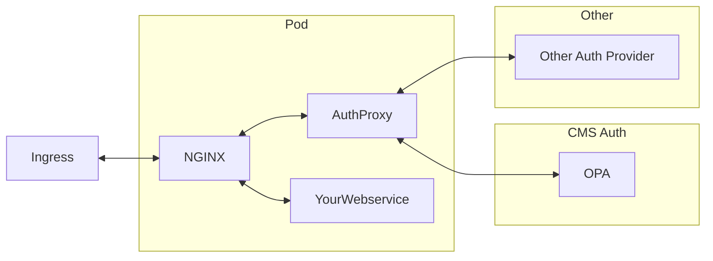
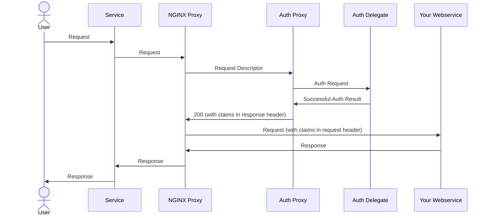
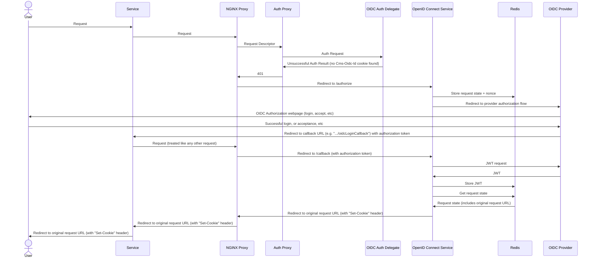
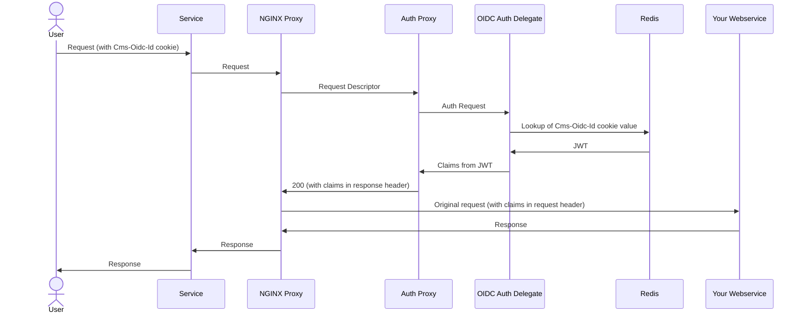

# Auth Injector Mutator

This is a [Helm](https://helm.sh/) chart that will install various configurations, but chiefly two [`MutatingWebhookConfiguration`](https://kubernetes.io/docs/reference/kubernetes-api/extend-resources/mutating-webhook-configuration-v1/) configurations that will inject an authentication framework into appropriately configured pods.

## Configuration

See the `values.yaml` file for details and descriptions of the parameters that can be modified.

> The following documentation mentions various headers, cookies, etc. Most of these things can be renamed in `values.yaml`, but the documentation will refer to their default values.

## Installation

To add OPA repo:

```bash
helm repo add opa https://open-policy-agent.github.io/kube-mgmt/charts
helm repo update
```

To get latest `opa-kube-mgmt` chart:

```bash
helm dependency update
```

To install _this_ chart:

```bash
helm install cms-auth \
--set "serviceAccount.name=yourServiceAccountName" \
--set auth.oidc.ingress.hosts."www\.whatever\.com"=your-ingress-tls-certs \
oci://cr.corporatemodelling.com/corporatemodelling/common/kubernetes/auth/auth-injector \
--version=[desired_version]
```

> 1. The service account should have relevant `imagePullSecrets` associated with it.
> 2. An ingress will be created for the OIDC service. Specify the name of the host(s) and their TLS secrets in the manner shown (note the `\`-escaped dots in the domain name). See the **OpenID Connect Service/Ingress** section near the end of this README for more details.
> 3. If using Kubernetes 1.27 or earlier, you should also add `--set useMatchConditions=false`, as the `matchConditions` feature is not available in 1.27 without opting-in
>    during `kubeadm` setup. If `useMatchConditions` is set to `false` in this way, you will have to explicitly add a `corporatemodelling.com/auth-injector: enabled` label to the deployments & services that you want to protect in addition to the various annotations (detailed below) that customize the injected auth. On versions higher than 1.27, the presence of the annotations is enough.

To uninstall:

```bash
helm uninstall cms-auth
```

## Namespaces

For the auth-injector to affect anything in any namespace, that namespace **MUST** be labelled with a special `corporatemodelling.com/auth-injector` label, with a value of `enabled`. The presence of this label permits the auth-injector to operate in that namespace.

To set the label:

```bash
kubectl label namespace your_namespace_name corporatemodelling.com/auth-injector=enabled
```

> The `corporatemodelling.com/` prefix is determined by the `auth.namespace` value in `values.yaml`, and the `auth-injector` name is determined by the chart
> name. Either of these values can be overridden at install time.

## What it mutates

Installing the chart does not affect any existing items in your cluster, only those installed afterwards, and only those
that have been annotated appropriately.

### Services

In the `metadata.annotations` collection of your service declaration, you will need the following annotation:

```yaml
cmsAuthTargetPortRedirect: "80"
```

This tells the mutator that any port (in the service's `spec.ports` collection) that maps to a `targetPort` of `80` should be redirected to the auth gateway.

### Deployments

In the `spec.template.metadata.annotations` collection of your deployment declaration, you should add some of these annotations:

> ⚠️ NOTE that **all** annotations are namespaced. The default namespace is `corporatemodelling.com` (determined by `auth.namespace` in `values.yaml`), so in that case, each annotation should be named `corporatemodelling.com/annotationName`.

| Annotation name                                           | Description                                                                                                                                                                                                                                                                                                                                                                                                                                                                                                      |
| --------------------------------------------------------- | ---------------------------------------------------------------------------------------------------------------------------------------------------------------------------------------------------------------------------------------------------------------------------------------------------------------------------------------------------------------------------------------------------------------------------------------------------------------------------------------------------------------- |
| `pre-authentication-policy-ids`                           | A comma-separated list of authentication policy IDs. These authentication policies will be enforced by the [Auth Proxy](https://gitlab.corporatemodelling.com/corporatemodelling/common/kubernetes/auth/auth-proxy) to authenticate any requests to your service before they reach your service.                                                                                                                                                                                                                 |
| `pre-authorization-policy-ids`                            | As above, but authorization policy IDs. You can use this to apply a "blanket" authorization policy to your service, if required.                                                                                                                                                                                                                                                                                                                                                                                 |
| `default-authentication-policies`                         | _(optional)_ The value for the `defaultAuthenticationPolicies` section of the auth config JSON in the protected webservice container. Default is `["pre_authenticated"]`. Value should parse as a JSON string array.                                                                                                                                                                                                                                                                                             |
| `authorization-policies-json` or `authorization-policies` | _(optional)_ The value for the `authorizationPolicies` section of the auth config JSON in the protected webservice container. Default is `{}`. The `...Json` value should parse as a JSON dictionary, string keys mapping to string array values. If the non-`Json` value is provided, it should be a list of strings, separated by commas. It will be converted to a dictionary with every string from the list mapping to `["pre_authenticated"]`. If both are provided, the `...Json` value takes precedence. |
| `allow-authentication-failure`                            | _(optional)_ If `true`, authentication failures at the Auth Proxy stage will still result in the request being passed to the target webservice (albeit with no claims). Default is `false`.                                                                                                                                                                                                                                                                                                                      |
| `route-authorization-policies-json`                       | _(optional)_ JSON for the `routeAuthorizationPolicies` section of the auth config in the auth proxy. Default is `{}`.                                                                                                                                                                                                                                                                                                                                                                                            |
| `unprotected-endpoints-regex`                             | _(optional)_ A regular expression that matches the paths of endpoints that should be entirely open, with no security. Requests to these endpoints will be passed directly to the target service without being re-routed via the auth proxy. Note that this _does not_ and _cannot_ nullify any security applied by the endpoint code itself: it only affects the injected auth framework.                                                                                                                        |

> Either of the `pre*-policy-ids` annotations are optional, but not both. If neither are specified, your deployment will not be touched by the mutator.

> NOTE: by default, the endpoints `/version`, `/health`, `/metrics`, and `/favicon.ico` are _not_ protected. There is no need to specify these in the `unprotected-endpoints-regex` annotation.

If your deployment is to be protected by OpenID Connect, you will also need:

| Annotation name                        | Description                                                                                                                                                                                                                                                                                                                        |
| -------------------------------------- | ---------------------------------------------------------------------------------------------------------------------------------------------------------------------------------------------------------------------------------------------------------------------------------------------------------------------------------- |
| `oidc-configuration`                   | URL to the "well-known" OpenID Connect configuration that you are using. For example, [here](https://login.microsoftonline.com/common/v2.0/.well-known/openid-configuration) is a configuration that would be used if you were using Microsoft as an OIDC provider.                                                                |
| `oidc-client-id`                       | Your OpenID Connect client ID, provided to you when you register with a provider.                                                                                                                                                                                                                                                  |
| `oidc-client-secret-id`                | The ID of the Kubernetes secret to retrieve. The OpenID Connect service (see below) should be running using a service account that can access the named secret.                                                                                                                                                                    |
| `oidc-client-secret-provider-base-uri` | Base URI for client secret provider webservice. The OIDC login service will (if required) make GET calls to this, appending the client secret ID that it needs. ⚠️ IMPORTANT: You should apply appropriate network policies to your cluster to ensure that only requests from the OIDC login service are accepted by this service. |
| `oidc-additional-authorize-parameters` | _(optional)_ Additional parameters you would want to append to the URL that is redirected to when starting the OpenID Connect authorization flow. This should probably start with `&`.                                                                                                                                             |
| `oidc-expected-audience`               | _(optional)_ If set, any token will be expected to have this value as the "audience" claim. If it does not match, the token is considered invalid.                                                                                                                                                                                 |
| `oidc-expected-issuer`                 | _(optional)_ If set, any token will be expected to have this value as the "issuer" claim. If it does not match, the token is considered invalid.                                                                                                                                                                                   |
| `oidc-scope`                           | _(optional)_ Scopes that will be requested in the OIDC authorization flow. As per OIDC convention, separate multiple scopes with `+`. Default is `openid+profile+email`.                                                                                                                                                           |
| `oidc-token-request-content-type`      | _(optional)_ Type of content to POST to the OIDC token endpoint. Some IDP's only support one specific format. Default is `application/x-www-form-urlencoded`.                                                                                                                                                                      |
| `oidc-pkce-code-challenge`             | _(optional)_ How to encode the PKCE code challenge (e.g. `S256`, `plain`). If `none`, PKCE will _not_ be used. Default is `S256`.                                                                                                                                                                                                  |
| `oidc-logout-endpoint`                 | _(optional)_ An endpoint which, if navigated to, will trigger a logout flow. Default is blank. Has no effect unless `oidc-post-logout-redirect-uri` is also defined.                                                                                                                                                               |
| `oidc-post-logout-redirect-uri`        | _(optional)_ URI to navigate to after successful logout. Default is blank. Has no effect unless `oidc-logout-endpoint` is also defined.                                                                                                                                                                                            |

> If using OpenID Connect, the `pre-authentication-policy-ids` annotation value should probably contain `open_id_connect`, which is [the name of the OpenID Connect authentication policy](https://gitlab.corporatemodelling.com/corporatemodelling/common/dotnet/webservices/auth/oidc-authentication-provider).

## Sidecars

If annotated appropriately, your deployment should now contain additional "sidecar" containers.



### NGINX

The first of those is an NGINX web server, which acts as a "security guard" reverse proxy between your webservice and the outside world. Any request that comes in will be redirected to this NGINX instance (thanks to the annotation in your Service declaration), sent to the Auth Proxy (see below) for authentication (and/or authorization), and, all being well, passed on to your webservice container with additional headers detailing the result of the authentication.

### Auth Proxy

The second sidecar container is an instance of the [Auth Proxy](https://gitlab.corporatemodelling.com/corporatemodelling/common/kubernetes/auth/auth-proxy). This is a webservice that authenticates (and optionally authorizes) incoming requests, leaving the webservice itself to only need to deal with the result of the authentication (i.e. the user claims). Depending on the auth configuration being used, the proxy might make requests to other authentication systems in other pods. For example, if the `opa` authentication provider is used, it would make a request to the OPA service created by this Helm chart. Alternatively, another authentication provider might make a request to a totally different bespoke service.

## UML

This UML describes the sequence of events that occur when a request is made to your webservice.



Note that the NGINX Proxy sends a "Request Descriptor" to the Auth Proxy. This is an object _describing_ the original user request.

> The "auth delegate" steps may or may not occur, depending on what authentication policy is being used (perhaps the policy is evaluated by an external provider, such as OPA?). Some authentication policies will not require any delegation.

In the event of unsuccessful authentication, a 401 would be returned to the NGINX proxy, and then to the user.

> If OpenID Connect is being used, a 401 redirect is added to the NGINX proxy, forwarding the request to the OpenID Connect authorization endpoint, which should start the authorization flow.

> If the Auth Proxy is configured to perform service-level authorization, it is also possible that a 403 could be returned.

## OpenID Connect UML

When OpenID Connect is used, this shows a typical first-contact dialogue:



> The NGINX Proxy is configured to redirect to the OpenID Connect service when it receives a 401. It is also configured to forward specific requests (by default, `/oidcLoginAuthorize` and `/oidcLoginCallback`) to the `/authorize` and `/callback` endpoints of the OpenID Connect service.

> The "request state" stored by the OIDC Auth Delegate includes the original request URL (so that it can redirected to upon successful authentication), the OIDC redirect URL (which is needed when using the received authorization code to request the actual JWT), plus [nonce](https://stackoverflow.com/questions/59984560/whats-the-nonce-function-on-oauth-authentication-process) data (a Redis key & value, both GUIDs), which are used to ensure that the callback `state` argument matches the original authorization request.

At this point, the user will now have a `Cms-Oidc-Id` cookie containing the name of a Redis key (a GUID) which has a value that is a valid JWT containing the authenticated OpenID Connect claims, and they will be redirected to the original request URL. This is also the state that they would be in if they had an existing cookie, and "manually" navigated to the request URL. In either case, the dialogue would then continue like this:



> If `auth.oidc.validateStoredTokens` is set to `true`, there will be additional steps where the `OIDC Auth Delegate` retrieves the JWKS from the OIDC provider and validates the JWT.

### Cookie

If the original request was an `https` request, the cookie will have a `Secure` attribute, and a `SameSite=Lax` attribute. If `http`, the `Secure` attribute will _not_ be added, and the `SameSite` attribute will be set to `None`. In either case, `HttpOnly` and `Max-Age` attributes are also applied.

## Auth Configuration

Your webservice will be [configured](./templates/protected-webservice-auth-config.yaml) to use an [auth configuration](https://gitlab.corporatemodelling.com/corporatemodelling/common/dotnet/webservices/auth/ws-auth) that uses the [`pre-authenticated` authentication provider](https://gitlab.corporatemodelling.com/corporatemodelling/common/kubernetes/auth/pre-authenticated-authentication-provider), and [`opa` authorization provider](https://gitlab.corporatemodelling.com/corporatemodelling/common/dotnet/webservices/auth/opa-server-auth-provider).

This means that your webservice will accept the user claims that are provided in a request header added by the NGINX Proxy (which will have obtained those claims from the Auth Proxy, using whatever policies were defined in the `*-policy-ids` annotations).

Your webservice endpoints can enforce authorization policies defined in OPA. These policy definitions will make decisions based on the claims. .NET webservices can simply use the appropriate [annotations](https://learn.microsoft.com/en-us/dotnet/api/microsoft.aspnetcore.authorization.authorizeattribute) or [extension methods](https://learn.microsoft.com/en-us/dotnet/api/microsoft.aspnetcore.builder.authorizationendpointconventionbuilderextensions.requireauthorization).

> Non-.NET services will need to add a small amount of code to make a call to OPA and react accordingly. Ideally, this authorization code would be defined in a library that can be re-used by all webservices written in that particular language.

## OPA

The chart installs an instance of an [OPA](https://www.openpolicyagent.org/) server. This is only used to calculate the mutated configurations.

It also installs the [OPA Kube Management](https://artifacthub.io/packages/helm/opa-kube-mgmt/opa-kube-mgmt) chart as a dependency, which includes a second OPA server instance. This instance is for actual auth policy processing. Any Rego or JSON data, added to the cluster as ConfigMap objects with appropriate labels, will be automatically added to the OPA server included in this chart.

## OpenID Connect

The chart also installs services to handle OpenID Connect functionality.

### OpenID Connect Service

This service handles authorization requests and callbacks.

#### Ingress

An NGINX ingress will be created to handle the OpenID Connect routing. By default, this is a mergeable `minion` ingress which relies upon a relevant `master` ingress to exist for the same host. This `master` ingress should define the `tls` information (see [Mergeable Ingress documentation](https://github.com/nginxinc/kubernetes-ingress/tree/v3.5.2/examples/ingress-resources/mergeable-ingress-types)).

For the default `minion` ingress, the TLS secret information supplied in the `auth.oidc.ingress.hosts.*` value dictionary is discarded. However, if you set `auth.oidc.ingress.mergeableType` to `master`, the
OpenID Connect ingress becomes a `master` ingress and includes the `tls` information.

#### Ingress URL Rewriting

If your ingress uses the Nginx Ingress Controller, and performs URL rewrites to strip a prefix from a URL path, you **must** use the `nginx.ingress.kubernetes.io/x-forwarded-prefix` annotation to specify the prefix part of the path, e.g.:

```yaml
metadata:
  name: my-ingress
  annotations:
    nginx.ingress.kubernetes.io/use-regex: "true"
    nginx.ingress.kubernetes.io/rewrite-target: /$2
    nginx.ingress.kubernetes.io/x-forwarded-prefix: /mytestapp
```

Without this, the OIDC redirect will, upon successful authentication, redirect your browser to the "rewritten" URL.

> If your ingress performs a more complex rewrite than basic "prefix-stripping", then the OIDC redirect will simply not work.

### Redis

This service is used as a store for OpenID Connect tokens. This instance is shared by all mutated deployments: the keys that are used to store tokens are GUIDs, and are very, very unlikely to clash.
